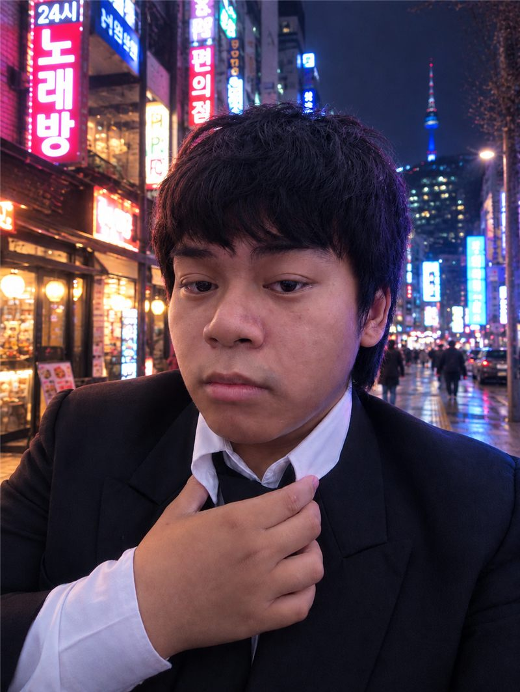
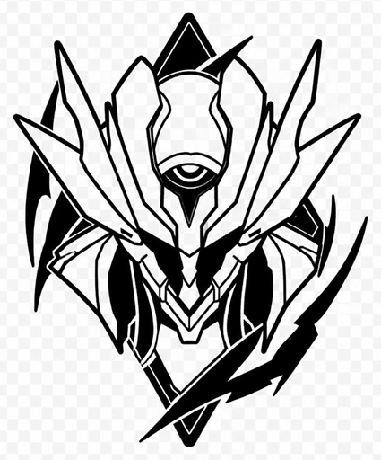

# 💙 Personal Brand Website

Website personal brand minimalis dengan **dua tema**:
- **Mode terang** — tema Firefly, hijau muda & hijau tua dengan putih sebagai inti
- **Mode gelap** — tema Suisei, biru muda & biru tua dengan langit bintang animasi

Bonus: **bilingual EN/ID** — bahasa default **English**, bisa diganti ke
Indonesia lewat tombol `EN/ID` di navbar (pilihan tersimpan di browser).

## Mode Terang / Gelap

- Tombol ikon **bulan/matahari** di kanan atas navbar untuk beralih mode.
- Pilihan tema tersimpan otomatis di browser (localStorage).
- Saat mode hitam aktif, bintang animasi dibuat otomatis via `js/script.js`.

## Cara Menjalankan

Cukup buka `index.html` dengan dobel-klik, atau jalankan server lokal:

```
python -m http.server 8080
```

lalu buka `http://localhost:8080` di browser.

## Cara Mengedit Konten

Semua teks &amp; terjemahannya ada di **`js/i18n.js`** (kamus `en` dan `id`).
Untuk menambah/mengubah kalimat, edit dua tempat (EN & ID) lalu tambahkan
`data-i18n="nama.key"` di elemen HTML yang bersangkutan. Struktur halaman
ada di **`index.html`**.

| Bagian | Apa yang diganti |
|---|---|
| **Nama & logo** | Ganti tulisan `CaptainBim` bila perlu (ada di beberapa tempat, termasuk footer) |
| **Profesi** | `Game Developer` (hero-role) |
| **Deskripsi hero** | Paragraf di bawah tombol |
| **Link sosial media** | Instagram, TikTok, Facebook, GitHub (sudah diisi, ubah bila perlu) |
| **Email** | `bimowashere@gmail.com` (ada 2 tempat) |
| **Tentang Saya** | Paragraf dan 3 kartu fakta |
| **Keahlian** | 4 kartu skill (ikon emoji bisa diganti) |
| **Portofolio** | 3 kartu proyek (judul, kategori, deskripsi) |
| **Foto** | Ganti file `images/foto-800.jpg` dengan foto baru (atau ubah `src` di hero) |

## Struktur File

```
D:\web\CaptainBim\
├── index.html        → isi website (struktur halaman)
├── README.md         → panduan ini
├── css\
│   └── style.css     → styling / tema warna
├── js\
│   ├── i18n.js       → semua teks & terjemahan EN/ID
│   └── script.js     → interaksi ringan (menu, tema, animasi)
├── images\
│   ├── logo.png      → logo utama (navbar & favicon tab browser)
│   ├── logo.jpg      → file logo asli dari Anda (vector.jpg)
│   ├── foto-800.jpg  → foto profil (versi kecil, cepat dimuat)
│   └── foto.jpg      → foto asli (cadangan)
└── referensi\
    └── referensi-logo.png → gambar referensi dari Anda
```

## Ganti Foto

Foto saat ini (file `foto-800.jpg`) sudah diganti dengan gambar terbaru Anda.
Untuk mengganti lagi:

1. Ganti file `images/foto-800.jpg` dengan foto baru (maksimal 800px lebar untuk
   loading cepat), **atau**
2. Simpan foto baru dengan nama lain, lalu ubah baris berikut di `index.html`:
   ```html
   
   ```

## Ubah Warna Tema

Warna diatur oleh variabel di bagian atas `css/style.css` — blok `:root` untuk
mode terang, dan blok `html.dark` untuk mode hitam.
Contoh: ubah `--accent` untuk mengganti warna aksen biru.

## Ganti Logo

Logo saat ini berasal dari file **`vector.jpg`** yang Anda berikan — sudah
dipotong otomatis ke area logonya dan tersimpan sebagai `logo.png` (dipakai
di navbar & favicon) serta `logo.jpg` (file asli).

Untuk mengganti dengan logo baru:

1. Simpan logo baru sebagai `images/logo.png` di folder `images` — navbar &amp; favicon
   otomatis ikut berubah.
2. Bila logo baru memakai nama file berbeda, ubah acuan berikut di `index.html`:
   ```html
                  <!-- di navbar -->
   <link rel="icon" href="images/logo.png" />      <!-- di <head> -->
   ```